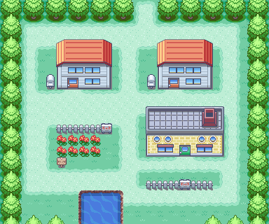
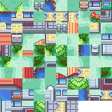

# mktile

`mktile` is a small utility that converts a provided image into a spritesheet with a custom tile width and size.

It has only been tested on Fedora Linux.

## Building

### Dependencies

- [raylib](https://github.com/raysan5/raylib)
- GNU Make
- A C++ compiler

### Build

Run `make` in the root folder, which will generate a `mkfile` binary.

## Use

### Supported Formats

BMP, GIF, JPG, PNG, PSD, TGA, PIC, QOI, HDR, TIFF, WEBP.

### Sample execution

```
$ mktile input.png 16 16 output.png
INFO: FILEIO: [assets/input.png] File loaded successfully
INFO: IMAGE: Data loaded successfully (384x320 | R8G8B8A8 | 1 mipmaps)
INFO: FILEIO: [assets/output.png] File saved successfully
INFO: FILEIO: [assets/output.png] Image exported successfully
```

**Input**:



**Output**:



## License

See LICENSE.md.
